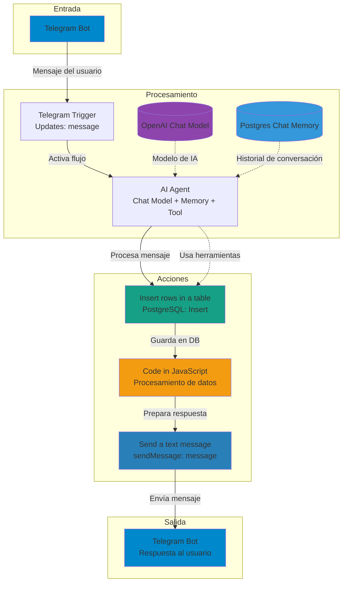

Arquitectura del flujo de n8n para el asistente de soporte:

Componentes principales:

Entrada: El bot de Telegram recibe mensajes de los usuarios
Procesamiento central:

El Telegram Trigger captura los mensajes entrantes
El AI Agent procesa las solicitudes utilizando un modelo de OpenAI y mantiene el contexto de la conversación en PostgreSQL

Acciones secuenciales:

Inserción de datos en PostgreSQL
Procesamiento con código JavaScript personalizado
Envío de respuesta al usuario via Telegram

Salida: El mensaje procesado se envía de vuelta al usuario en Telegram

El flujo está diseñado como un chatbot conversacional con memoria persistente que puede ejecutar acciones como guardar información en base de datos y procesar lógica personalizada antes de responder.
